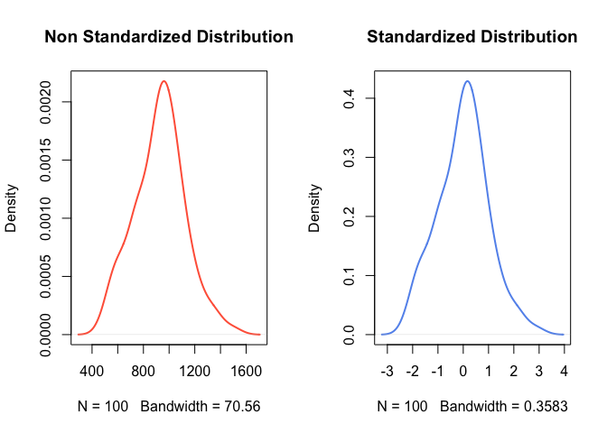
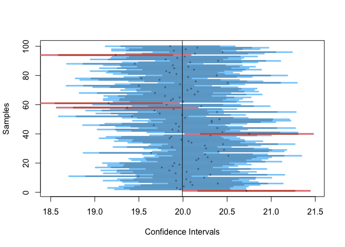
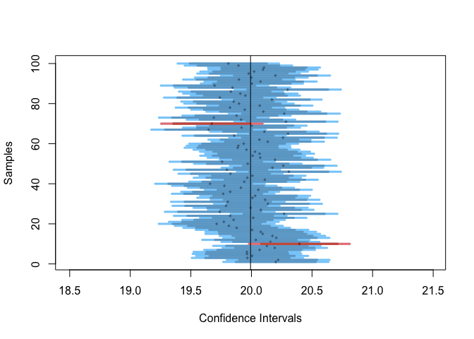

Computational Statistics in Business Analytics - Confidence Intervals
================

**Author:** Daniele Melotti<br> **Date:** Nov 2023

# 1. Data Standardization and Exploration

## Standardize a synthetic dataset

Data standardization is essentially the process of rescaling data so
that it has a mean of 0 and a standard deviation of 1. This process is
particularly helpful in guaranteeing data consistency, allowing for
comparisons between variables that are measured with different scales.
To execute data standardization, we need to subtract the mean of a
vector from all its values, and divide this difference by the standard
deviation to get a vector of standardized values. We demonstrate this on
a synthetic dataset, which we create following a normal distribution
with mean of 940 and standard deviation of 190.

``` r
# Setting seed
set.seed(194)

rnorm_raw <- rnorm(n = 100, mean = 940, sd = 190) # non-standardized data
rnorm_std <- (rnorm_raw - mean(rnorm_raw))/sd(rnorm_raw) # standardized data
```

## Analyze the standardized data

We shall make sure that the mean and standard deviation of the
standardized dataset are 0 and 1 respectively:

``` r
mean(rnorm_std)
```

    ## [1] -2.451424e-16

``` r
sd(rnorm_std)
```

    ## [1] 1

This is the case indeed. **What shape of the standardized distribution
do we expect in comparison to that of the non standardized data?** The
shape of the distribution of rnorm_std should be bell-shaped, as for a
normal distribution. That’s because *the standardization process does
not transform the structure of underlying distribution* (hence, it does
not influence the shape of the distribution); standardization only turns
raw data into z-scores (it changes the scale of data), therefore, if the
non-standardized distribution is normal (bell-shaped), its standardized
version will also be normal. Similarly, a non-normally shaped
distribution will remain non-normally shaped after standardization.
Let’s confirm this:

``` r
par(mfrow = c(1, 2))
plot(density(rnorm_raw), lwd = 2, main = "Non Standardized Distribution",
     col = "tomato")
plot(density(rnorm_std), lwd = 2, main = "Standardized Distribution",
     col = "cornflowerblue")
```



Indeed, the shape of both distributions is identical and roughly
bell-shaped. Standardization plays a crucial role in statistics,
especially in the context of confidence intervals; in fact, it helps
compute confidence intervals correctly by removing scale-based biases.

# 2. Confidence Intervals Simulation

In most cases, we do not have an entire population at hand, therefore we
draw a sample. We then use the sample to estimate a parameter or a set
of parameters of the population, such as mean or variance. Most likely
the parameter that we estimate from the sample is different from that of
the population. Now, imagine that we draw a few samples, not just one.
Certainly, these samples are going to present a different value of the
parameter of interest. Here, a confidence interval comes handy; namely,
*a confidence interval is the range in which the true parameter lies
with a certain probability* (often 95% or 99%). Hence, a confidence
interval helps us say that we are 95% or 99% confident that the
parameter of interest lies within the interval.

In order to explore confidence intervals, we are going to use the
function `plot_sample_ci()` from the non-CRAN package `compstatslib`.
The `plot_sample_ci`() function simulates samples drawn randomly from a
population. Each sample is a horizontal line with a dark band for its
95% confidence interval, a lighter band for its 99% confidence interval,
and a dot for its mean. The population mean is a vertical black line.
Samples whose 95% confidence interval includes the population mean are
blue, and others are red. Let’s install the package first:

``` r
require(devtools) # loading devtools for installing non-CRAN packages
```

    ## Loading required package: devtools

    ## Loading required package: usethis

``` r
#install_github("soumyaray/compstatslib") # installing compstatslib package
require(compstatslib) #loading compstatslib
```

    ## Loading required package: compstatslib

## Display confidence intervals of a 100 samples (each of size 100), generated from a normally distributed population of 10,000

We are going to generate 100 samples from a normally distributed
population of 10,000. We arbitrarily choose to set the mean to 20 and
the standard deviation to 3. We expect on average 5% of the samples to
not include the true value of the mean when we consider a 95% CI (5
samples out of 100), while 1% of the samples should not include the true
mean when considering a 99% CI (1 sample out of 100).

``` r
# Setting seed
set.seed(200)

plot_sample_ci(num_samples = 100, sample_size = 100, pop_size = 10000,
               distr_func = rnorm, mean = 20, sd = 3)
```



As we can see, 5 samples out of a 100 do not include the true mean
within a 95% CI, while there is only 1 sample that does not include the
mean within a 99% CI. Keep in mind that the results will be affected if
the seed is changed.

## Rerun the previous simulation with the same number of samples, but increase the sample size to 300. Visualize the confidence intervals

We are going to rerun the previous simulation, with the only difference
of increasing each sample’s size to 300. In this new scenario, we still
expect on average 5% of the samples to not include the true value of the
mean when we consider a 95% CI (5 samples out of 100), while 1% of the
samples should not include the true mean when considering a 99% CI (1
sample out of 100). One difference which we expect from the previous
scenario is that the CIs should become narrower, because increasing the
sample size reduces the standard error (sample size n is at the
denominator of the formula for calculating standard error; the greater
the n, the smaller the error), providing a smaller CI.

``` r
# Setting seed
set.seed(200)

plot_sample_ci(num_samples = 100, sample_size = 300, pop_size = 10000,
               distr_func = rnorm, mean = 20, sd = 3)
```



Overall, the intervals are in fact narrower than in the first scenario
we analyzed. Here, we only meet 2 samples that do not include the true
mean within 95% CI, with no sample not including the true mean within
99% CI.

# 3. Confidence Intervals and Uniform Distributions

## Display confidence intervals as in the first two scenarios, but generate the data from a uniform distribution

Now, we create new confidence intervals, using the same parameters as in
the first two scenarios, with the exception of generating the data from
a uniformly distributed population. We still expect 5% of the samples to
not include the population mean in their 95% CI, and 1% of the samples
to not include it in their 99% CI. However, the CIs for the uniform
distribution will be wider than those for the normal distribution on
average, because the uniform distribution usually presents a higher
standard deviation, which increases the standard error (as standard
deviation is at the numerator of the formula for standard error).
Uniform distributions usually have a larger standard deviation because
they bring the most conservative estimate of uncertainty (every outcome
has the same likelihood of happening). Let’s confirm it:

``` r
# Setting seed
set.seed(180)

# First scenario (sample size = 100)
par(mfrow = c(1, 2))
plot_sample_ci(num_samples = 100, sample_size = 100, pop_size = 10000,
               distr_func = runif)
title("Uniform distribution")
plot_sample_ci(num_samples = 100, sample_size = 100, pop_size = 10000,
               distr_func = rnorm)
title("Normal distribution")
```


``` r
# Setting seed
set.seed(180)

# Second scenario (sample size = 300)
par(mfrow = c(1, 2))
plot_sample_ci(num_samples = 100, sample_size = 300, pop_size = 10000,
               distr_func = runif)
title("Uniform distribution")
plot_sample_ci(num_samples = 100, sample_size = 300, pop_size = 10000,
               distr_func = rnorm)
title("Normal distribution")
```


As we can see from the plots above (check x-axis values), it is indeed
true that when generating samples from a uniform distribution, the
confidence intervals will be wider than when we generate samples from a
normal distribution.

# Summary

In this project, we briefly dived into the topics of data
standardization and confidence intervals. We began by standardizing a
synthetic dataset generated from a normal distribution, outlining the
benefits of data standardization. Also, we learned that when
standardizing data, the underlying distribution remains unchanged. Next,
we proceeded to generate several samples from a normal distribution,
verifying the properties of confidence intervals. We noticed that when
we increase sample size, the confidence intervals become narrower, and
that when we sample from a uniformly distributed population, the
confidence intervals tend to be wider than those of samples generated
from a normal distribution.
